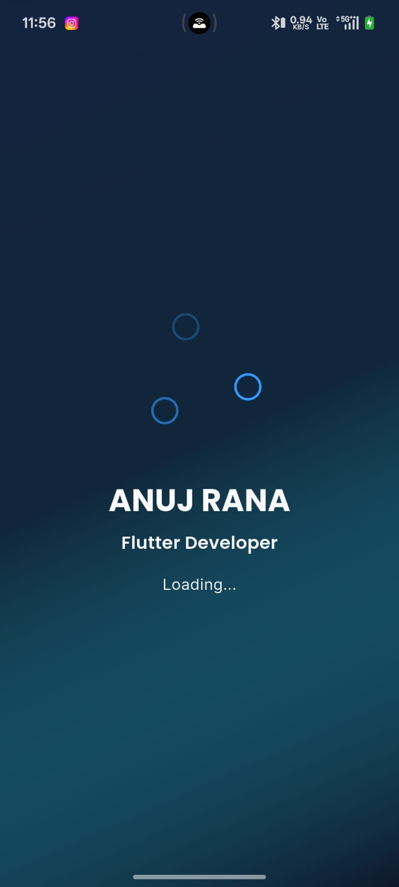
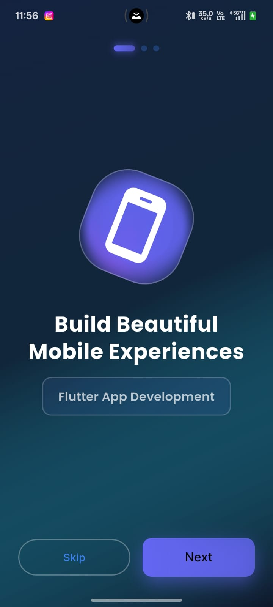
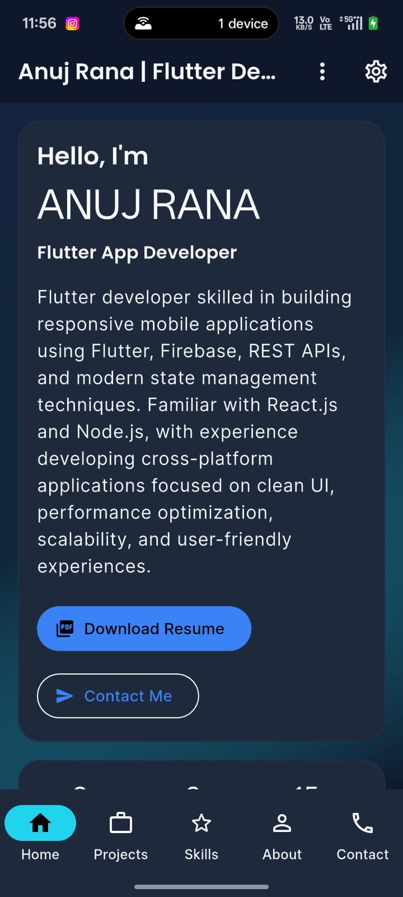
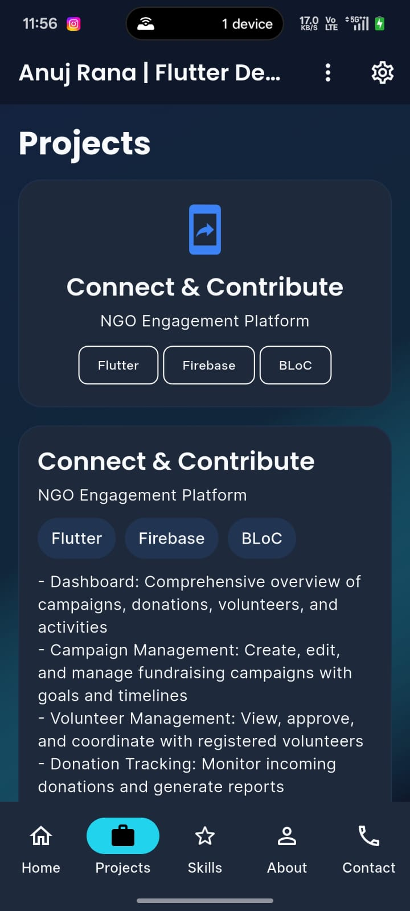
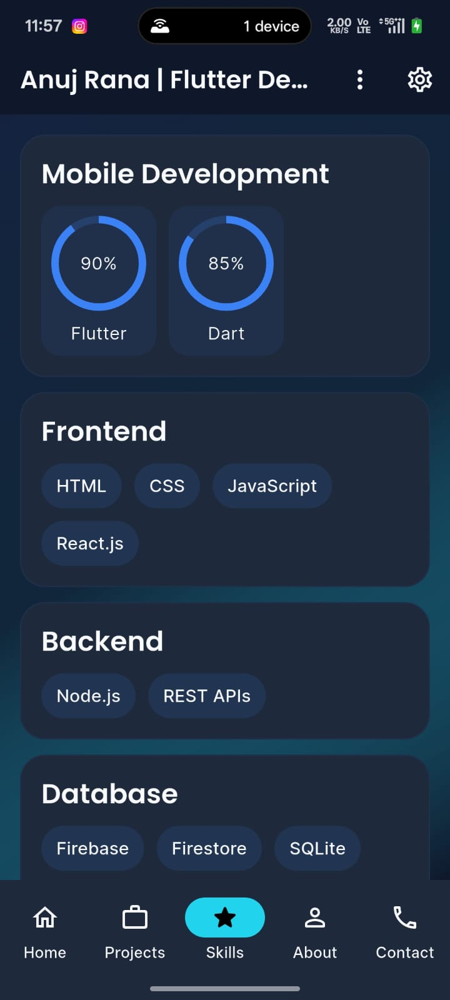
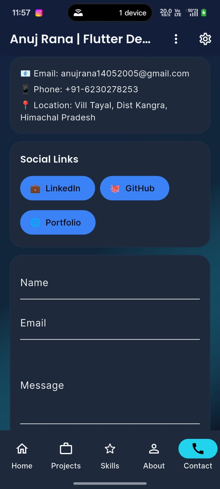
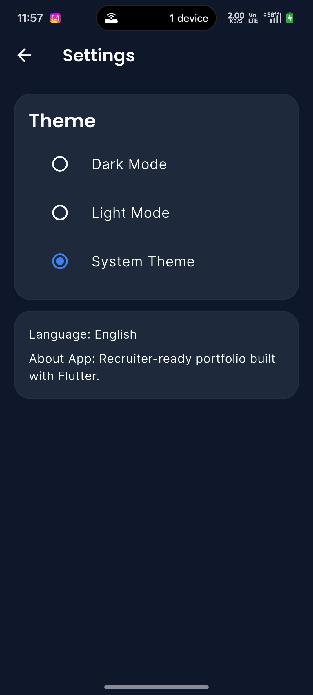
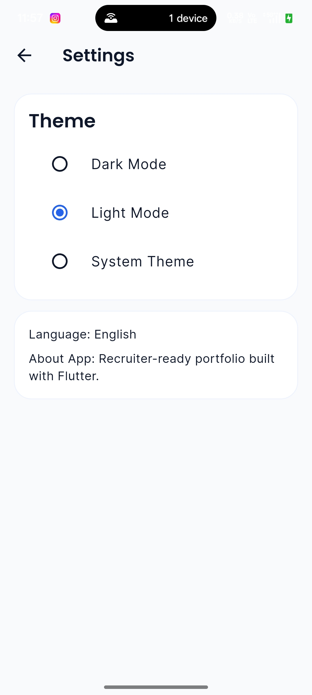

# 🚀 Anuj Rana - Flutter Developer Portfolio

<div align="center">
  <h3>A stunning, production-ready Flutter portfolio app showcasing skills, projects, and professional experience.</h3>
  <p>
    <strong>Built with Flutter • Firebase • BLoC State Management • Clean Architecture</strong>
  </p>
</div>

---

## 📱 App Screenshots

<div align="center">
  <table>
    <tr>
      <td align="center" width="25%">
        <strong>Splash Screen</strong><br/>
        
      </td>
      <td align="center" width="25%">
        <strong>Onboarding</strong><br/>
        
      </td>
      <td align="center" width="25%">
        <strong>Home Screen</strong><br/>
        
      </td>
      <td align="center" width="25%">
        <strong>Projects</strong><br/>
        
      </td>
    </tr>
    <tr>
      <td align="center" width="25%">
        <strong>Skills</strong><br/>
        
      </td>
      <td align="center" width="25%">
        <strong>Contact</strong><br/>
        
      </td>
      <td align="center" width="25%">
        <strong>Dark Mode</strong><br/>
        
      </td>
      <td align="center" width="25%">
        <strong>Light Mode</strong><br/>
        
      </td>
    </tr>
  </table>
</div>

---

## ✨ Key Features

### 🎯 **Responsive Design**
- Beautifully crafted UI/UX with smooth animations
- Dark Mode & Light Mode support
- Fully responsive across all device sizes
- Optimized for both phones and tablets

### 📊 **Comprehensive Portfolio**
- **Home Section**: Professional introduction and quick links
- **Projects Section**: Showcase of completed projects with GitHub integration
- **Skills Section**: Display of technical competencies with proficiency levels
- **About Section**: Detailed professional background
- **Contact Section**: Easy-to-use contact form and social media links

### 🔗 **Social Integration**
- Direct links to GitHub, LinkedIn, and personal portfolio
- Functional contact form for inquiries
- Resume download capability
- Email integration for contact submissions

### 🎨 **Customization Options**
- Theme switching (Dark/Light/System)
- Language support (English)
- Persistent theme preference storage
- Smooth theme transitions

### 🔥 **Firebase Integration**
- Real-time data synchronization
- Analytics tracking
- Scalable backend infrastructure
- Cloud Firestore support

---

## 🛠️ Tech Stack

### **Frontend**
- **Flutter**: Cross-platform mobile development framework
- **Dart**: Programming language with null-safety features
- **BLoC**: State management pattern for clean architecture

### **Design & UI**
- **Custom Widgets**: Reusable component library
- **Animations**: Smooth transitions using Lottie animations
- **Google Fonts**: Beautiful typography
- **Carousel Slider**: Image carousel for showcase

### **Backend & Services**
- **Firebase Core**: Backend infrastructure
- **Firebase Analytics**: User behavior tracking
- **REST APIs**: Integration with external services
- **Google Sheets API**: Dynamic content management

### **Utilities**
- **URL Launcher**: Open links and emails
- **Path Provider**: File system access
- **Shared Preferences**: Local data persistence
- **PDF Plugin**: Resume download functionality
- **HTTP Client**: API communication

---

## 📋 Project Structure

```
lib/
├── main.dart                 # App entry point
├── core/                     # Core utilities & constants
│   ├── constants/           # App-wide constants
│   ├── extensions/          # Dart extensions
│   └── utils/               # Helper utilities
├── data/                    # Data layer (API, local storage)
│   ├── repositories/        # Data repositories
│   ├── models/              # Data models
│   └── datasources/         # API & local data sources
├── presentation/            # UI layer
│   ├── screens/             # Screen widgets
│   ├── widgets/             # Reusable UI components
│   └── bloc/                # BLoC state managers
├── services/                # External services
│   ├── firebase_service.dart
│   ├── analytics_service.dart
│   └── google_sheets_service.dart
└── widgets/                 # Custom widgets
```

---

## 🚀 Getting Started

### **Prerequisites**
- Flutter SDK (3.8.1 or higher)
- Dart SDK (null-safety enabled)
- Android SDK (for Android development)
- Xcode (for iOS development)
- Git

### **Installation**

1. **Clone the repository**
```bash
git clone https://github.com/RANANUJ/anuj_portfolio.git
cd anuj_portfolio
```

2. **Install dependencies**
```bash
flutter pub get
```

3. **Set up Firebase** (Optional)
- Download `google-services.json` for Android
- Download `GoogleService-Info.plist` for iOS
- Place them in their respective directories

4. **Run the app**
```bash
# For debug mode
flutter run

# For specific device
flutter run -d <device-id>

# For release build
flutter run --release
```

---

## 📲 Running on Devices

### **Android**
```bash
# Connect Android device or start emulator
adb devices  # To check connected devices

# Run the app
flutter run
```

### **iOS**
```bash
# Install pods
cd ios
pod install
cd ..

# Run the app
flutter run
```

### **Web** (if enabled)
```bash
flutter run -d chrome
```

---

## 🎯 App Sections Overview

### **🏠 Home Screen**
The landing page featuring:
- Professional introduction
- Quick action buttons (Resume, Contact)
- Eye-catching design with animations
- Call-to-action sections

### **💼 Projects Section**
Showcasing portfolio projects with:
- Project cards with descriptions
- Technology stack badges
- Direct GitHub repository links
- Project feature highlights

### **⭐ Skills Section**
Displaying technical expertise:
- Skill categories (Frontend, Backend, Database, etc.)
- Proficiency indicators (circular progress)
- Technology badges
- Overall competency visualization

### **ℹ️ About Section**
Professional background including:
- Detailed bio and experience
- Career milestones
- Educational background
- Professional achievements

### **📞 Contact Section**
Multiple contact options:
- LinkedIn profile link
- GitHub profile link
- Personal portfolio website
- Direct contact form

### **⚙️ Settings**
User preferences:
- Dark/Light/System theme selection
- Language settings
- App information
- Persistent preference storage

---

## 🔧 Configuration

### **Environment Setup**
Edit files for customization:

1. **Update Portfolio Content**
   - Modify `lib/data/repositories/portfolio_repository.dart`
   - Update projects, skills, and experience data

2. **Theme Customization**
   - Edit colors in `lib/core/constants/app_colors.dart`
   - Modify typography in `lib/core/constants/app_text_styles.dart`

3. **Firebase Setup**
   - Add Firebase credentials
   - Configure Firestore rules
   - Enable analytics

4. **API Integration**
   - Update API endpoints in `lib/data/datasources/`
   - Configure authentication tokens

---

## 🌟 Highlights

✅ **Production-Ready Code**
- Clean architecture following SOLID principles
- Comprehensive error handling
- Optimized performance
- Proper state management

✅ **User Experience**
- Smooth animations and transitions
- Responsive design
- Intuitive navigation
- Accessibility considerations

✅ **Developer Experience**
- Well-organized codebase
- Clear documentation
- Reusable components
- Easy to extend and maintain

✅ **Testing Ready**
- Modular architecture supports unit testing
- BLoC pattern enables easy testing
- Mock-friendly data layer

---

## 📚 Additional Resources

- **Flutter Documentation**: https://flutter.dev/docs
- **Firebase Setup Guide**: [See FIREBASE_CLOUD_FUNCTION_SETUP.js](./FIREBASE_CLOUD_FUNCTION_SETUP.js)
- **Google Sheets Integration**: [See GOOGLE_SHEETS_SETUP.md](./GOOGLE_SHEETS_SETUP.md)
- **Setup Instructions**: [See SETUP_GUIDE.md](./SETUP_GUIDE.md)
- **Quick Start**: [See QUICK_START.md](./QUICK_START.md)
- **Onboarding Guide**: [See ONBOARDING_ENHANCEMENT_GUIDE.md](./ONBOARDING_ENHANCEMENT_GUIDE.md)

---

## 🐛 Known Issues & Solutions

### Firebase Initialization Warning
```
Firebase initialization error: Failed to load FirebaseOptions from resource
```
**Solution**: Add `google-services.json` (Android) and configure Firebase properly.

### URL Launcher Not Working (Android 12+)
**Solution**: Ensure AndroidManifest.xml has proper intent queries configured.

---

## 🔄 Build & Release

### **Debug Build**
```bash
flutter build apk --debug
```

### **Release Build**
```bash
flutter build apk --release
flutter build appbundle --release  # For Play Store
```

### **iOS Build**
```bash
flutter build ios --release
```

---

## 📧 Contact & Support

- **GitHub**: [@RANANUJ](https://github.com/RANANUJ)
- **LinkedIn**: [Anuj Rana](https://www.linkedin.com/in/anujrana12)
- **Portfolio**: [anujrana.dev](https://anujrana.dev)
- **Email**: For direct inquiries, use the in-app contact form

---

## 📄 License

This project is personal portfolio work. Please respect intellectual property rights.

---

## 👨‍💻 About the Developer

**Anuj Rana** is a Flutter App Developer skilled in building responsive, production-ready mobile applications using Flutter, Firebase, REST APIs, and modern state management techniques. With expertise in clean architecture and SOLID principles, Anuj focuses on creating user-friendly experiences and scalable applications.

### Expertise:
- 📱 Flutter & Dart Development
- 🔥 Firebase & Firestore
- 🎨 UI/UX Design Implementation
- 🔄 State Management (BLoC)
- 🌐 REST API Integration
- ⚡ Performance Optimization

---

<div align="center">
  <p>
    <strong>Made with ❤️ by Anuj Rana</strong>
  </p>
  <p>
    ⭐ If you find this portfolio helpful, please consider giving it a star!
  </p>
</div>

